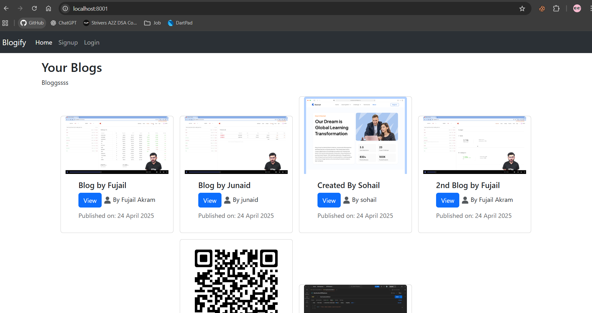
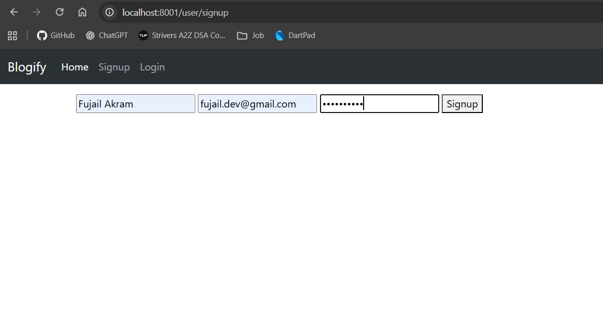
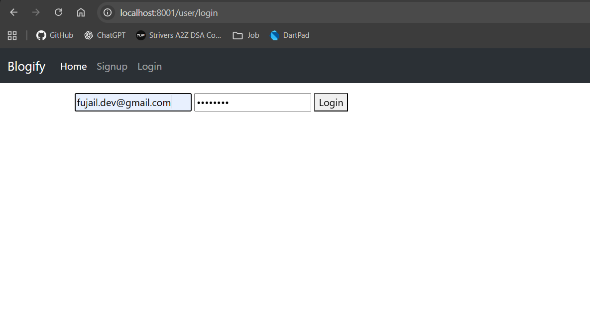
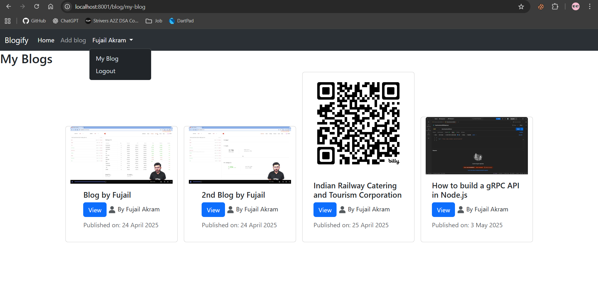
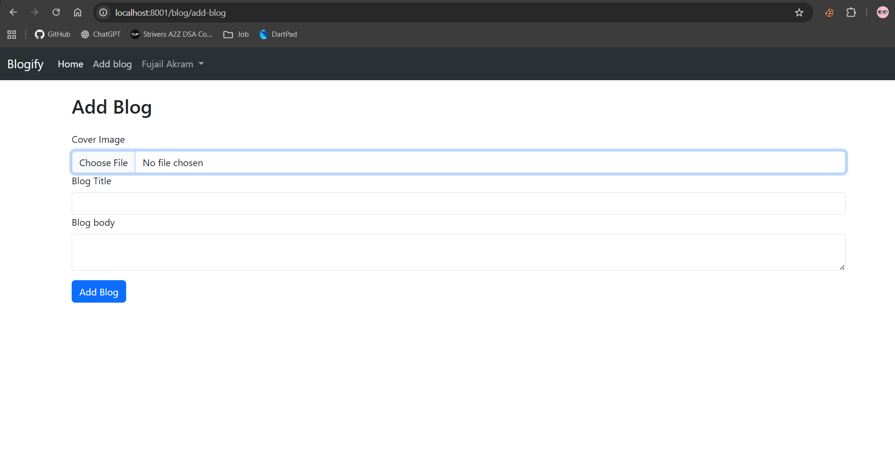
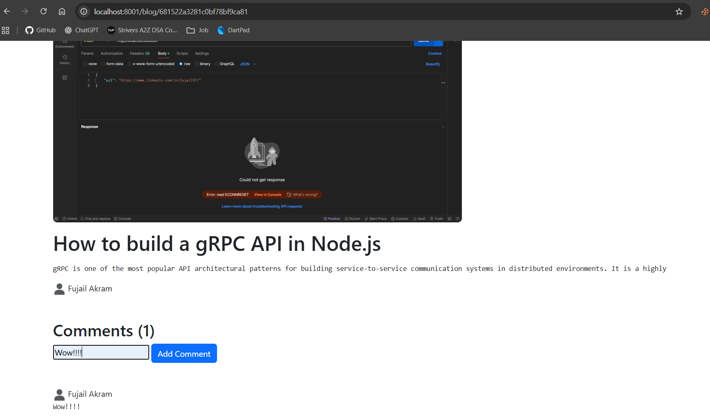

# BlogMitra – Blogging Platform
- Developed a secure blogging platform with user signup/login, allowing users to create blog posts, comment, and view authorship details.
- Implemented authentication using JWT and password encryption with bcrypt for secure user management.
- Managed data with MongoDB and designed a dynamic frontend using EJS templates and Bootstrap.

## Project Setup

Before starting, make sure you have the following installed:
- Node.js (version 20 or higher)
- npm (comes with Node.js)

### To set up the project:

1. Clone this repository
```bash
git clone https://github.com/fujail57/BlogMitra.git
cd [repository-name]
```

2. Install dependencies
```bash
npm install
```

3. Start the development server
```bash
npm run dev
```

### To set up the project using Docker:

- You can find the Docker image here: [fujail57/blogmitra](https://hub.docker.com/repository/docker/fujail57/blogmitra/general)

1. Check docker is install or not
```bash
docker -v
```

2. Clone this repository
```bash
git clone https://github.com/fujail57/BlogMitra.git
cd [repository-name]
```

3. Start the server using docker
```bash
docker compose up
```

4. Application should be run on this URL
```bash
http://localhost:3000/
```


## Webpage view

1. Home page




2. Signup page




3. Login page




4. My Blog




5. Add Blog 




6. Add Comment 




The application should now be running on `http://localhost:3000` .
